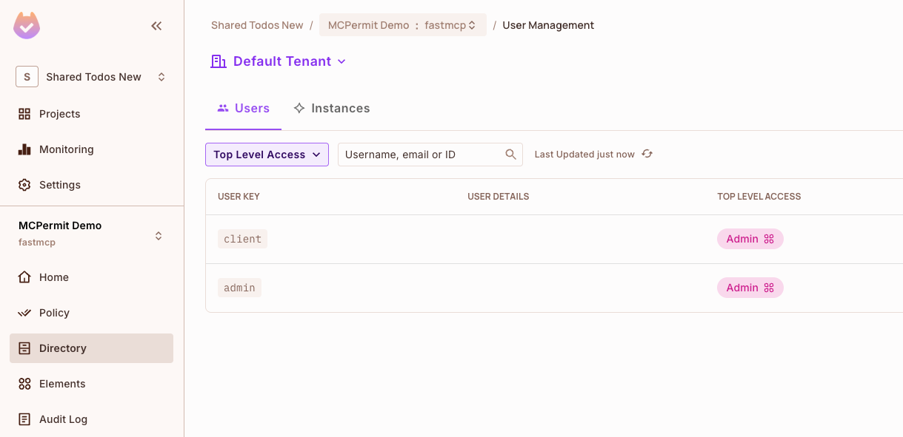

# permit-fastmcp

A FastMCP middleware that adds Permit.io authorization to your MCP servers. This middleware intercepts MCP requests and validates them against Permit.io policies before allowing them to proceed.

## Installation

```bash
# Using UV (recommended)
uv add permit-fastmcp

# Using pip
pip install permit-fastmcp
```

## Quick Start

```python
from fastmcp import FastMCP
from permit_fastmcp.middleware.middleware import PermitMcpMiddleware

mcp = FastMCP("My MCP Server")

# Add Permit.io authorization middleware
mcp.add_middleware(PermitMcpMiddleware(
    permit_pdp_url="http://localhost:7766",
    permit_api_key="your-permit-api-key"
))

@mcp.tool
def my_tool(data: str) -> str:
    return f"Processed: {data}"

if __name__ == "__main__":
    mcp.run(transport="http")
```

## How Policy Mapping Works

- **MCP server methods** (e.g., `tools/list`, `resources/read`):
  - **Resource**: `{server_name}_{component}` (e.g., `myserver_tools`)
  - **Action**: The method verb (e.g., `list`, `read`)
- **Tool execution** (method `tools/call`):
  - **Resource**: `{server_name}` (e.g., `myserver`)
  - **Action**: The tool name (e.g., `greet`)


*Example: In Permit.io, the 'Admin' role is granted permissions on resources and actions as mapped by the middleware. For example, 'greet', 'greet-jwt', and 'login' are actions on the 'mcp_server' resource, and 'list' is an action on the 'mcp_server_tools' resource.*

> **Note:**
> Don’t forget to assign the relevant role (e.g., Admin, User) to the user authenticating to your MCP server (such as the user in the JWT) in the Permit.io Directory. Without the correct role assignment, users will not have access to the resources and actions you’ve configured in your policies.
>
> 
>
> *Example: In Permit.io Directory, both 'client' and 'admin' users are assigned the 'Admin' role, granting them the permissions defined in your policy mapping.*

## Example: JWT Authentication

See [`permit_fastmcp/example_server/example.py`](permit_fastmcp/example_server/example.py) for a full example of JWT-based authentication and usage.

## More Documentation

- [Advanced Configuration](./docs/advanced-configuration.md)
- [Identity Modes & Environment Variables](./docs/identity-modes.md)
- [Detailed Policy Mapping](./docs/policy-mapping.md)
- [Configuration Reference](./docs/configuration-reference.md)
- [Troubleshooting](./docs/troubleshooting.md)
- [Getting Started & FAQ](./docs/getting-started.md)

## License

This project is licensed under the Apache License 2.0. See the LICENSE file for details.

